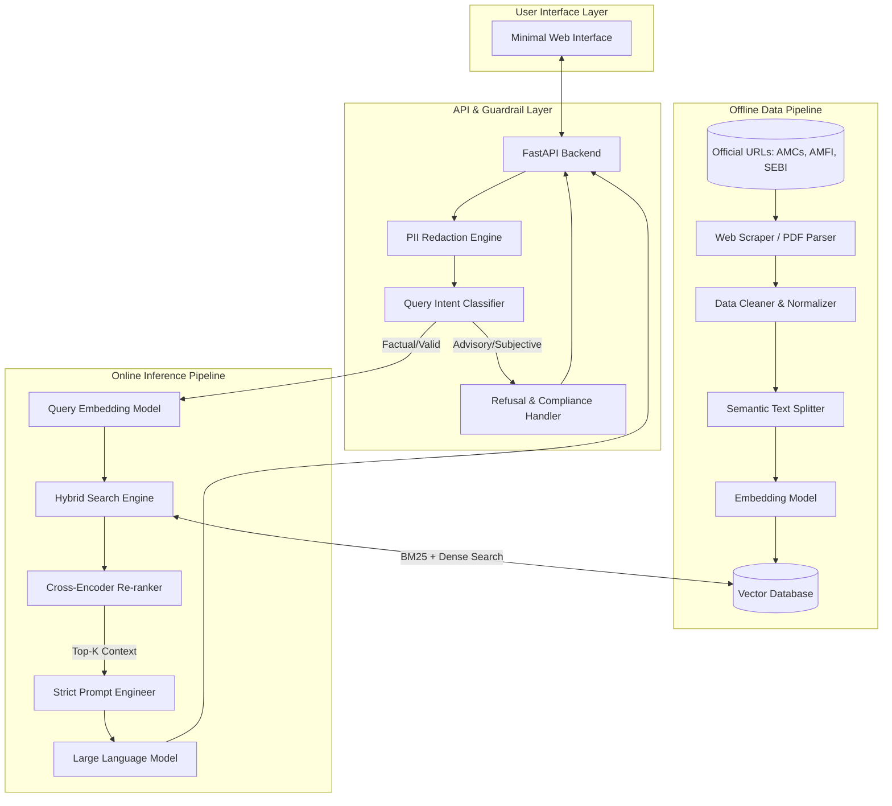

# Detailed Architecture: Mutual Fund FAQ Assistant (RAG)

## 1. System Overview

The Mutual Fund FAQ Assistant is built on a **Retrieval-Augmented Generation (RAG)** architecture. The system is designed to prioritize factual accuracy, strict compliance (no investment advice), and minimal latency. It consists of two main pipelines: an **Offline Data Ingestion Pipeline** and an **Online Inference Pipeline**.

---

## 2. Architectural Diagram

---

## 3. Component Details

### A. Data Ingestion Pipeline (Offline)
This pipeline is responsible for maintaining the knowledge base. It runs on a scheduled basis (e.g., weekly) to keep facts up to date.

- **Data Sources:** 
  - Parses the 100-150 curated URLs (AMC websites, Factsheets, SIDs, KIMs, AMFI/SEBI guidelines).
- **Web Scraping & Document Parsing:** 
  - Uses tools like `Playwright` for dynamic pages and `PyPDF2` / `pdfplumber` for Factsheets and Scheme Information Documents (SIDs).
- **Data Cleaning:** 
  - Removes headers, footers, and irrelevant HTML markup to reduce noise.
- **Text Chunking:** 
  - Uses a `RecursiveCharacterTextSplitter` or semantic chunker to split documents into manageable chunks (e.g., 500-1000 tokens) with appropriate overlap to preserve context.
- **Embedding Generation:** 
  - Chunks are passed through a highly semantic embedding model (e.g., OpenAI `text-embedding-3-small` or BAAI `bge-large-en`).
- **Vector Database (VDB):** 
  - Embeddings and their associated metadata (Source URL, extraction date, AMC name) are stored in a scalable vector store like `Pinecone`, `Milvus`, or `Qdrant`.

### B. API & Guardrail Layer
Before a query reaches the LLM, it is strictly validated.

- **FastAPI Backend:** Lightweight asynchronous server acting as the orchestrator.
- **PII Redaction Engine:** 
  - Uses Regex and NLP models (like Microsoft Presidio) to block or redact sensitive information (PAN, Aadhaar, phone numbers, OTPs) *before* it gets logged or processed.
- **Query Intent Classifier:** 
  - A lightweight zero-shot classifier (or fine-tuned small LLM) determines if a query is factual (e.g., *"What is the exit load?"*) or advisory/subjective (e.g., *"Is this fund good for retirement?"*).
- **Refusal Handler:** 
  - If the classifier flags the query as advisory, the process is short-circuited. A standard, polite refusal is returned containing an educational link (e.g., AMFI investor education portal).

### C. Retrieval & Generation Pipeline (Online)
This is the core RAG inference engine.

- **Query Embedding:** Converts the cleaned user query into a vector representation.
- **Hybrid Retrieval:** 
  - Combines **Dense Vector Search** (for semantic understanding) and **Sparse Search (BM25)** (for exact keyword matching like scheme codes or names).
- **Re-ranking (Optional but recommended):** 
  - A Cross-Encoder model re-scores the retrieved chunks to ensure the most highly relevant context is passed to the LLM.
- **Prompt Builder:** 
  - Constructs a strict prompt injecting the retrieved context. 
  - **System Prompt Rules:**
    1. Answer *only* using the provided context. If the answer is not present, reply with: "I do not have this information."
    2. Limit the response to a maximum of **3 sentences**.
    3. Include exactly **one markdown link** to the source URL.
    4. Append the footer: *"Last updated from sources: <date>"*.
- **Generation Model (LLM):** 
  - A fast, capable LLM (e.g., GPT-4o-mini, Claude 3.5 Haiku, or Llama 3) generates the response while adhering strictly to the prompt constraints.

### D. User Interface (Frontend)
- **Framework:** A lightweight React or Next.js application, or a simple HTML/JS frontend.
- **Design:**
  - **Welcome Message & Disclaimer:** Clearly states: *"Facts-only. No investment advice."*
  - **Quick Prompts:** Provides 3 predefined example questions to onboard the user immediately.
  - **Minimalist Chat:** A simple chat window focusing entirely on the Q&A experience.

---

## 4. Security & Compliance Rules

1. **Zero Data Retention for PII:** The system does not log or persist user PII. The PII filter blocks data at the entry point.
2. **Absolute Hallucination Prevention:** The LLM temperature is set to `0.0`. The model is strictly instructed to refuse answering if the context provided by the Vector Database does not contain the answer.
3. **Auditability:** Every response sent to the user is explicitly paired with a verifiable source link.
4. **No Financial Calculation:** The system will not perform bespoke return calculations or compare historical performances across funds. Users asking for performance are simply directed to the official factsheet.
